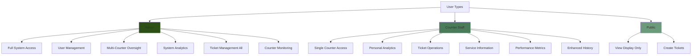
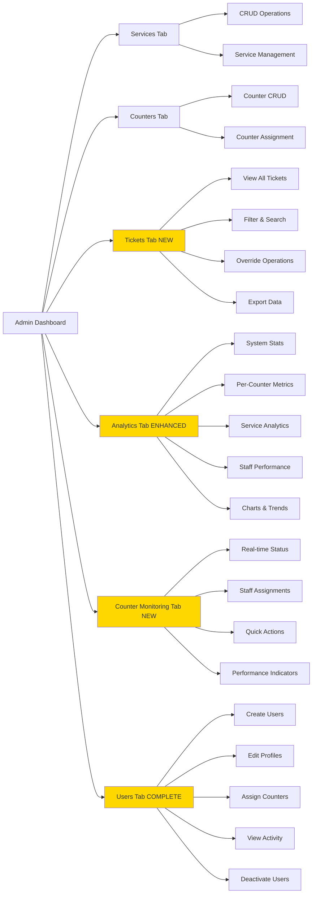
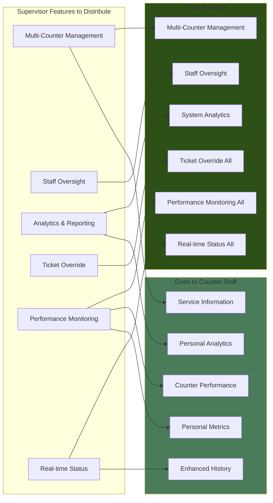
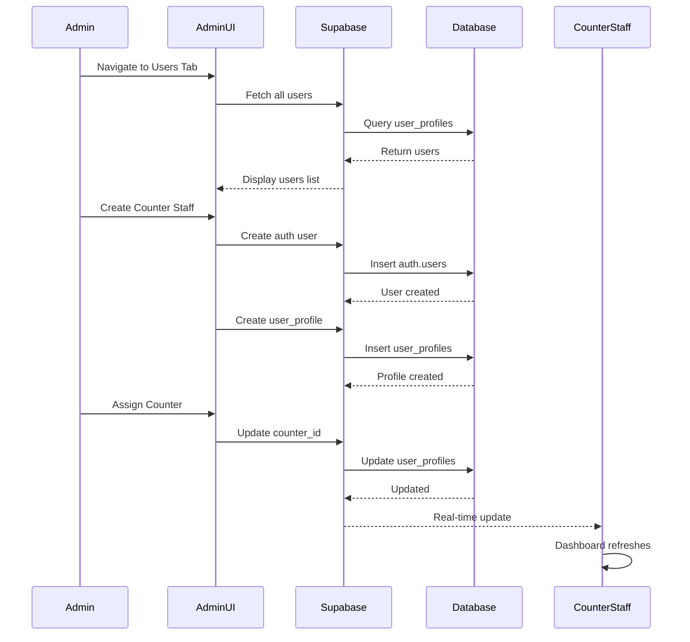
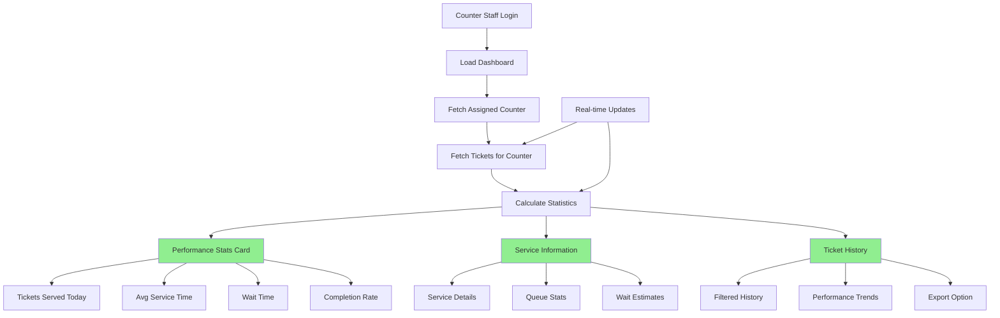

# QMS Implementation Diagrams - Role Distribution Plan

## Diagram 1: Role Hierarchy and Capabilities Distribution



## Diagram 2: Admin Dashboard Structure



## Diagram 3: Counter Staff Dashboard Structure

```mermaid
flowchart TD
    A[Counter Staff Dashboard] --> B[Performance Stats NEW]
    A --> C[Service Information NEW]
    A --> D[Next Ticket]
    A --> E[Current Ticket Actions]
    A --> F[Enhanced History]
    
    B --> B1[Tickets Served Today]
    B --> B2[Average Service Time]
    B --> B3[Current Wait Time]
    B --> B4[Service Completion Rate]
    B --> B5[Visual Indicators]
    
    C --> C1[Service Name]
    C --> C2[Service Description]
    C --> C3[Queue Statistics]
    C --> C4[Expected Wait Times]
    
    D --> D1[Display Next Ticket]
    D --> D2[Call Next Button]
    
    E --> E1[Serve]
    E --> E2[Recall]
    E --> E3[Skip]
    E --> E4[Transfer]
    
    F --> F1[Filter by Date]
    F --> F2[Search Functionality]
    F --> F3[Export History]
    F --> F4[Service Time Calc]
    F --> F5[Performance Trends]
    
    style B fill:#90ee90
    style C fill:#90ee90
    style F fill:#90ee90
```



## Diagram 4: Data Flow and Permissions

```mermaid
flowchart TB
    subgraph auth[Authentication Layer]
        U[User Login]
        UP[User Profile]
        R{Role Check}
    end
    
    subgraph admin[Admin Access]
        A1[All Services]
        A2[All Counters]
        A3[All Tickets]
        A4[All Users]
        A5[All Analytics]
    end
    
    subgraph counter[Counter Staff Access]
        C1[Assigned Counter Only]
        C2[Counter Tickets Only]
        C3[Personal Stats]
        C4[Service Info Read]
    end
    
    subgraph db[(Database)]
        DB1[RLS Policies]
        DB2[Row Level Security]
    end
    
    U --> UP
    UP --> R
    R -->|admin| admin
    R -->|counter_staff| counter
    R -->|public| P[Public Display]
    
    admin --> DB1
    counter --> DB1
    DB1 --> DB2
    DB2 -->|Enforces| admin
    DB2 -->|Enforces| counter
    
    style admin fill:#2d5016
    style counter fill:#4a7c59
    style db fill:#6b9b7a
```

## Diagram 5: Feature Distribution Matrix



## Diagram 6: Admin User Management Flow



## Diagram 7: Counter Staff Analytics Flow



## Diagram 8: Database RLS Policy Structure

```mermaid
flowchart TB
    subgraph tables[Database Tables]
        T1[services]
        T2[counters]
        T3[tickets]
        T4[user_profiles]
        T5[audit_logs]
    end
    
    subgraph admin_policies[Admin Policies]
        AP1[Full Access Services]
        AP2[Full Access Counters]
        AP3[Full Access Tickets]
        AP4[Full Access Users]
        AP5[Full Access Audit]
    end
    
    subgraph counter_policies[Counter Staff Policies]
        CP1[Read Services]
        CP2[Read Assigned Counter]
        CP3[Update Assigned Counter Tickets]
        CP4[Read Own Profile]
    end
    
    subgraph public_policies[Public Policies]
        PP1[Read Services]
        PP2[Read Counters]
        PP3[Read Tickets]
    end
    
    T1 --> AP1
    T1 --> CP1
    T1 --> PP1
    
    T2 --> AP2
    T2 --> CP2
    T2 --> PP2
    
    T3 --> AP3
    T3 --> CP3
    T3 --> PP3
    
    T4 --> AP4
    T4 --> CP4
    
    T5 --> AP5
    
    style admin_policies fill:#2d5016
    style counter_policies fill:#4a7c59
    style public_policies fill:#6b9b7a
```



## Summary

These diagrams show:
1. **Role Distribution**: How supervisor capabilities are split between Admin and Counter Staff
2. **Dashboard Structure**: What each role sees and can do
3. **Data Flow**: How permissions and RLS policies work
4. **Feature Matrix**: Which features go to which role
5. **Process Flows**: How key operations work
6. **Security**: Database-level access control

The key principle: **Admin gets oversight capabilities, Counter Staff gets personal performance tools**.

